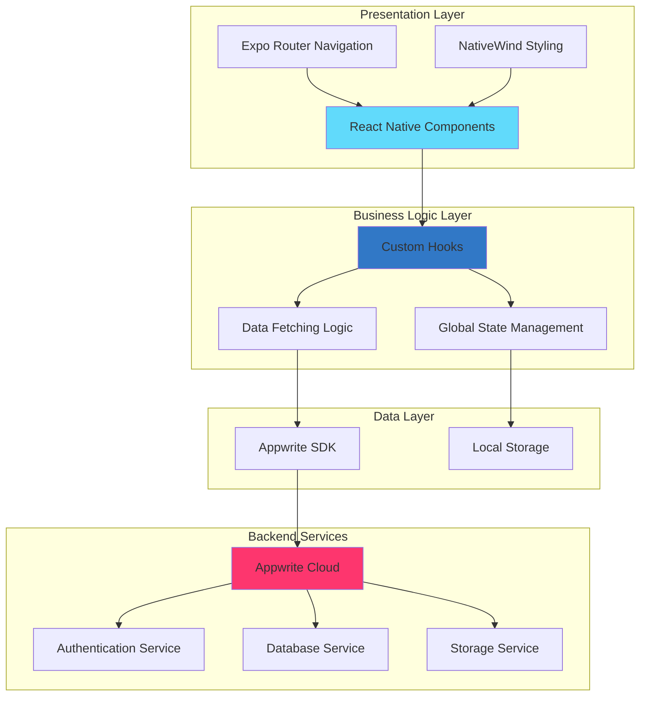
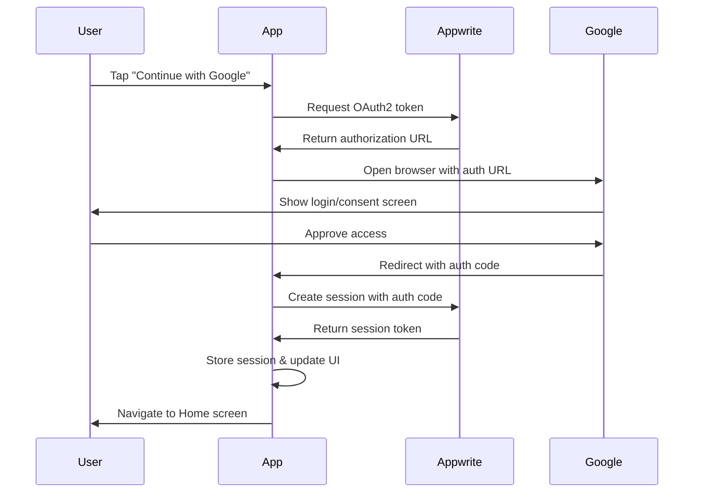
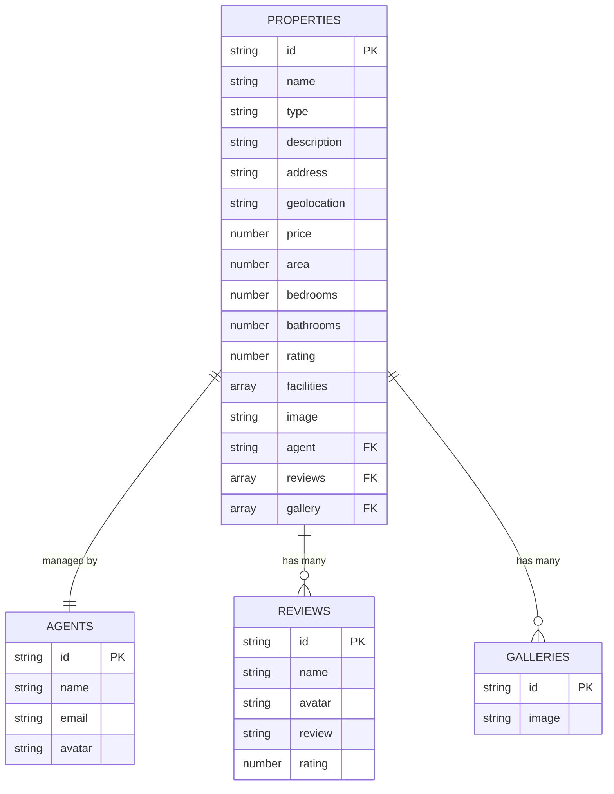

<div align="center">
  <br />
  <h1>🏡 Real Scout - Real Estate Application</h1>
  <p><strong>Your Gateway to Finding the Perfect Home</strong></p>
  
  <div>
    
    
    
    
    
    
  </div>
  
  <br />
  
  
  
  
  
  
</div>

---

## 📋 Table of Contents

1. [🎯 Introduction](#-introduction)
2. [✨ Features](#-features)
3. [🏗️ Architecture](#️-architecture)
4. [⚙️ Tech Stack](#️-tech-stack)
5. [📱 Screenshots](#-screenshots)
6. [🚀 Getting Started](#-getting-started)
7. [📁 Project Structure](#-project-structure)
8. [🔐 Authentication Flow](#-authentication-flow)
9. [💾 Database Schema](#-database-schema)
10. [🧪 Testing](#-testing)
11. [🗺️ Future Roadmap](#️-future-roadmap)
12. [👨‍💻 Author](#-author)
13. [📄 License](#-license)

---

## 🎯 Introduction

**Real Scout** is a modern, full-stack real estate mobile application built with React Native and Expo. It provides users with a seamless experience to browse, search, and explore properties with an intuitive interface and powerful features. The app leverages Google OAuth for secure authentication and Appwrite as a backend-as-a-service platform for managing data, authentication, and storage.

### Key Highlights

- 🔒 **Secure Authentication** with Google OAuth
- 🏠 **Dynamic Property Listings** with advanced search and filtering
- 📱 **Cross-platform** support (iOS & Android)
- 🎨 **Modern UI/UX** with NativeWind (Tailwind CSS for React Native)
- ⚡ **Fast Performance** with optimized data fetching
- 🔄 **Real-time Updates** with Appwrite
- 🌱 **Database Seeding** utility for quick setup

---

## ✨ Features

| Feature                   | Description                                               | Status         |
| ------------------------- | --------------------------------------------------------- | -------------- |
| **Google Authentication** | Seamless OAuth 2.0 login with Google                      | ✅ Implemented |
| **Property Browsing**     | Browse all available properties with pagination           | ✅ Implemented |
| **Advanced Search**       | Search properties by name, address, or type               | ✅ Implemented |
| **Smart Filters**         | Filter properties by type (House, Apartment, Villa, etc.) | ✅ Implemented |
| **Property Details**      | Comprehensive property information with image gallery     | ✅ Implemented |
| **User Profiles**         | Manage user settings and preferences                      | ✅ Implemented |
| **Agent Information**     | View detailed agent profiles and contact info             | ✅ Implemented |
| **Reviews & Ratings**     | Read property reviews and ratings                         | ✅ Implemented |
| **Facilities Overview**   | View property amenities (Gym, Pool, Parking, etc.)        | ✅ Implemented |
| **Database Seeding**      | Quick setup with sample data                              | ✅ Implemented |
| **Responsive Design**     | Optimized for all screen sizes                            | ✅ Implemented |
| **Offline Support**       | Cache data for offline viewing                            | 🔄 In Progress |
| **Push Notifications**    | Get notified about new properties                         | 📋 Planned     |
| **Favorites/Wishlist**    | Save properties for later viewing                         | 📋 Planned     |
| **Property Comparison**   | Compare multiple properties side-by-side                  | 📋 Planned     |

---

## 🏗️ Architecture

Real Scout follows a clean, scalable architecture pattern with clear separation of concerns:



### Architecture Layers

1. **Presentation Layer**: React Native components styled with NativeWind
2. **Business Logic Layer**: Custom hooks and state management
3. **Data Layer**: Appwrite SDK integration with local caching
4. **Backend Services**: Appwrite cloud services for auth, database, and storage

---

## ⚙️ Tech Stack

### Frontend

| Technology           | Version | Purpose                            |
| -------------------- | ------- | ---------------------------------- |
| **React Native**     | 0.81.5  | Cross-platform mobile framework    |
| **Expo**             | ~54.0.0 | Development platform and toolchain |
| **TypeScript**       | ^5.3.3  | Type-safe JavaScript               |
| **NativeWind**       | ^4.1.23 | Tailwind CSS for React Native      |
| **Expo Router**      | ~6.0.19 | File-based routing                 |
| **React Navigation** | ^7.0.0  | Navigation library                 |

### Backend & Services

| Technology             | Purpose                     |
| ---------------------- | --------------------------- |
| **Appwrite**           | Backend-as-a-Service (BaaS) |
| **Google OAuth**       | Authentication provider     |
| **Appwrite Databases** | NoSQL document database     |
| **Appwrite Storage**   | File storage and CDN        |

### Development Tools

| Tool       | Purpose                |
| ---------- | ---------------------- |
| **Jest**   | Unit testing framework |
| **ESLint** | Code linting           |
| **Babel**  | JavaScript compiler    |
| **Metro**  | JavaScript bundler     |

---

## 📱 Screenshots

> Coming soon: Screenshots and demo videos will be added here

---

## 🚀 Getting Started

### Prerequisites

Ensure you have the following installed:

- **Node.js** (v18 or higher) - [Download](https://nodejs.org/)
- **npm** or **yarn** - Comes with Node.js
- **Git** - [Download](https://git-scm.com/)
- **Expo Go** app on your mobile device (for testing)
  - [iOS App Store](https://apps.apple.com/app/expo-go/id982107779)
  - [Google Play Store](https://play.google.com/store/apps/details?id=host.exp.exponent)

### Installation Steps

#### 1. Clone the Repository

```bash
git clone https://github.com/Mausam5055/Real-Estate-APP.git
cd Real-Estate-APP
```

#### 2. Install Dependencies

```bash
npm install
```

or with yarn:

```bash
yarn install
```

#### 3. Set Up Environment Variables

Create a `.env.local` file in the root directory:

```env
EXPO_PUBLIC_APPWRITE_ENDPOINT=https://cloud.appwrite.io/v1
EXPO_PUBLIC_APPWRITE_PROJECT_ID=your_project_id
EXPO_PUBLIC_APPWRITE_DATABASE_ID=your_database_id
EXPO_PUBLIC_APPWRITE_GALLERIES_COLLECTION_ID=your_galleries_collection_id
EXPO_PUBLIC_APPWRITE_REVIEWS_COLLECTION_ID=your_reviews_collection_id
EXPO_PUBLIC_APPWRITE_AGENTS_COLLECTION_ID=your_agents_collection_id
EXPO_PUBLIC_APPWRITE_PROPERTIES_COLLECTION_ID=your_properties_collection_id
EXPO_PUBLIC_APPWRITE_BUCKET_ID=your_bucket_id
```

#### 4. Configure Appwrite

1. Create an account at [Appwrite Cloud](https://cloud.appwrite.io/)
2. Create a new project
3. Set up the following collections in your database:

**Collections Schema:**

| Collection     | Attributes                                                                                                                                                                       |
| -------------- | -------------------------------------------------------------------------------------------------------------------------------------------------------------------------------- |
| **Properties** | name, type, description, address, geolocation, price, area, bedrooms, bathrooms, rating, facilities, image, agent (relationship), reviews (relationship), gallery (relationship) |
| **Agents**     | name, email, avatar                                                                                                                                                              |
| **Reviews**    | name, avatar, review, rating                                                                                                                                                     |
| **Galleries**  | image                                                                                                                                                                            |

4. Enable Google OAuth provider in Appwrite Authentication settings
5. Copy your credentials to the `.env.local` file

#### 5. Seed the Database (Optional)

After setting up Appwrite, you can seed your database with sample data:

1. Run the application
2. Navigate to the Profile section
3. Tap on "🌱 Seed Database"

Or programmatically:

```typescript
import seed from "./lib/seed";
await seed();
```

#### 6. Start the Development Server

```bash
npm start
```

or

```bash
npx expo start
```

#### 7. Run on Your Device

- **Using Expo Go**: Scan the QR code with your camera (iOS) or Expo Go app (Android)
- **iOS Simulator**: Press `i` in the terminal
- **Android Emulator**: Press `a` in the terminal

---

## 📁 Project Structure

```
Real-Estate-APP/
├── app/                          # Application screens and routing
│   ├── (root)/                   # Protected routes
│   │   ├── (tabs)/              # Bottom tab navigation
│   │   │   ├── index.tsx        # Home screen
│   │   │   ├── explore.tsx      # Explore properties screen
│   │   │   └── profile.tsx      # User profile screen
│   │   └── properties/          # Property details
│   │       └── [id].tsx         # Dynamic property detail page
│   ├── _layout.tsx              # Root layout
│   ├── sign-in.tsx              # Authentication screen
│   └── seed-data.tsx            # Database seeding utility
├── assets/                       # Static assets
│   ├── fonts/                   # Custom fonts
│   ├── icons/                   # Icon images
│   └── images/                  # App images
├── components/                   # Reusable components
│   ├── Cards.tsx                # Property card component
│   ├── Comment.tsx              # Review comment component
│   ├── Filters.tsx              # Filter component
│   ├── NoResults.tsx            # Empty state component
│   └── Search.tsx               # Search bar component
├── constants/                    # App constants
│   ├── icons.ts                 # Icon exports
│   ├── images.ts                # Image exports
│   └── data.ts                  # Static data
├── lib/                         # Core utilities and services
│   ├── appwrite.ts              # Appwrite configuration and API
│   ├── global-provider.tsx      # Global state provider
│   ├── useAppwrite.ts           # Custom data fetching hook
│   ├── seed.ts                  # Database seeding logic
│   └── data.ts                  # Sample data for seeding
├── .env.local                   # Environment variables
├── app.json                     # Expo configuration
├── package.json                 # Dependencies
├── tailwind.config.js           # Tailwind configuration
└── tsconfig.json                # TypeScript configuration
```

---

## 🔐 Authentication Flow

The app uses Google OAuth 2.0 for secure authentication:



### Authentication Implementation

```typescript
// lib/appwrite.ts
export async function login() {
  const redirectUri = Linking.createURL("/");
  const response = await account.createOAuth2Token(
    OAuthProvider.Google,
    redirectUri
  );

  const browserResult = await openAuthSessionAsync(
    response.toString(),
    redirectUri
  );

  const url = new URL(browserResult.url);
  const secret = url.searchParams.get("secret");
  const userId = url.searchParams.get("userId");

  const session = await account.createSession(userId, secret);
  return session;
}
```

---

## 💾 Database Schema

### Entity Relationship Diagram



### Collection Details

#### Properties Collection

| Field       | Type         | Description                        | Required |
| ----------- | ------------ | ---------------------------------- | -------- |
| name        | String       | Property name                      | Yes      |
| type        | String       | Property type (House, Villa, etc.) | Yes      |
| description | Text         | Detailed description               | Yes      |
| address     | String       | Physical address                   | Yes      |
| geolocation | String       | Lat/Long coordinates               | No       |
| price       | Number       | Property price                     | Yes      |
| area        | Number       | Area in sq ft                      | Yes      |
| bedrooms    | Number       | Number of bedrooms                 | Yes      |
| bathrooms   | Number       | Number of bathrooms                | Yes      |
| rating      | Number       | Average rating (1-5)               | Yes      |
| facilities  | Array        | List of amenities                  | No       |
| image       | String       | Main property image URL            | Yes      |
| agent       | Relationship | Related agent ID                   | Yes      |
| reviews     | Relationship | Array of review IDs                | No       |
| gallery     | Relationship | Array of gallery IDs               | No       |

---

## 🧪 Testing

### Running Tests

```bash
# Run all tests
npm test

# Run tests in watch mode
npm test -- --watch

# Run tests with coverage
npm test -- --coverage
```

### Test Structure

```
__tests__/
├── components/
│   ├── Cards.test.tsx
│   └── Search.test.tsx
├── lib/
│   ├── appwrite.test.ts
│   └── useAppwrite.test.ts
└── integration/
    └── authentication.test.tsx
```

---

## 🗺️ Future Roadmap

### Phase 1: Enhanced User Experience (Q1 2025)

- [ ] **Favorites/Wishlist Feature**

  - Save properties for later viewing
  - Sync across devices
  - Share wishlist with others

- [ ] **Advanced Filters**

  - Price range slider
  - Multiple facility selection
  - Sort by distance, price, rating

- [ ] **Property Comparison**
  - Compare up to 3 properties side-by-side
  - Visual comparison charts
  - Export comparison as PDF

### Phase 2: Engagement & Notifications (Q2 2025)

- [ ] **Push Notifications**

  - New property alerts based on preferences
  - Price drop notifications
  - Saved search alerts

- [ ] **In-App Messaging**

  - Direct chat with agents
  - Schedule property viewings
  - Real-time message notifications

- [ ] **Virtual Tours**
  - 360° property views
  - Video walkthroughs
  - AR room visualization

### Phase 3: Advanced Features (Q3 2025)

- [ ] **AI-Powered Recommendations**

  - Personalized property suggestions
  - Smart search based on user behavior
  - Price prediction models

- [ ] **Mortgage Calculator**

  - EMI calculator
  - Loan eligibility checker
  - Bank comparison

- [ ] **Offline Mode**
  - Cache property data for offline viewing
  - Sync when back online
  - Download property brochures

### Phase 4: Social & Integration (Q4 2025)

- [ ] **Social Features**

  - Share properties on social media
  - Invite friends & family to view
  - Community reviews and ratings

- [ ] **Third-Party Integrations**

  - Google Maps integration for directions
  - Calendar integration for appointments
  - Email integration for updates

- [ ] **Analytics Dashboard**
  - User activity tracking
  - Property view statistics
  - Search trend analysis

### Long-Term Vision

- **Multi-Language Support**: Add support for regional languages
- **Dark Mode**: Complete dark theme implementation
- **Web Platform**: Expand to web using React.js
- **Admin Dashboard**: Property management portal for agents
- **Payment Gateway**: Integrate booking/token payment
- **Blockchain Integration**: Property ownership verification using NFTs

---

## 👨‍💻 Author

<div align="center">
  
### **Mausam Kar**

[](https://github.com/Mausam5055)
[](https://linkedin.com/in/mausamkar)
[](mailto:mausamkar@example.com)

**Full-Stack Developer | React Native Enthusiast | Open Source Contributor**

</div>

---

## 📄 License

This project is licensed under the **MIT License** - see the [LICENSE](LICENSE) file for details.

**Copyright (c) 2024 Mausam Kar**

---

## 🙏 Acknowledgments

- **Expo Team** for the amazing development platform
- **Appwrite** for the powerful BaaS solution
- **React Native Community** for continuous support and resources
- **NativeWind** for bringing Tailwind CSS to React Native

---

## 📞 Support

If you encounter any issues or have questions:

1. Check the [Issues](https://github.com/Mausam5055/Real-Estate-APP/issues) page
2. Create a new issue with detailed information
3. Join our community discussions
4. Contact the author directly

---

<div align="center">
  
**⭐ Star this repository if you found it helpful!**

**Made with ❤️ by Mausam Kar**

</div>
